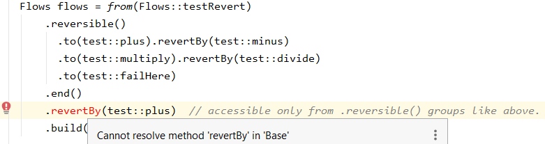

# Floref
Floref is a Java workflow engine based on functional programming with **method references** used to: <br>
- refer existing code or other workflows. 
- define a flow with fluent instructions acting on method references. <br>
- import/update a flow at **runtime** (from a database/UI). <br>

Method references can target interfaces while the actual implementation can be **injected** at runtime.<br>
With the use of aliases a flow can be defined using **simpler business notations** instead of method references.<br>
The flows can be exported (JSON) and updated at **runtime**. <br>
Easy to get started, powerful features and extensible.

# Flow reference
A FLOw REFerence is an **interface method** also called the flow start method since it uniquely identifies the flow.<br>
Floref fluent API is used to define what that flow reference will do when called.<br>
Any user interface method can be a workflow.<br>


# Flow definition
```java
public class Example {
  // 1. Interface containing flows.
  interface MyFlows {
    String runJob(Job job);  // flow 1
    void recordJob(Job job); // flow 2
  }
  static class Job { }
  static class FooService {
    public Job validate(Job job) { return job; }
    public String sendTo3rdParty(Job job) {return "done";}
    public void record(Job job) {System.out.println("recorded");}
  }
  public static void main(String args[]) {
    // 2. Define and build.
    FooService service = new FooService();
    MyFlows flows = Flows.from(MyFlows::runJob)
        .to(service::validate)     // run instance::method or class::method (instance injectable)
        .fork(MyFlows::recordJob)  // run in separate thread, do not wait for result
        .retry(service::sendTo3rdParty).times(10).delay(1000)  // retry external calls
        .build();

    // Another flow used in the one above.
    Flows.from(MyFlows::recordJob)
        .to(service::record)
        .build();

    // 3. Run.
    String status = flows.runJob(new Job());
    System.out.println(status); // done
  }
}
```
Only step 2 needs Floref in order to create a define a flow implementation and return a flow instance that can be used 
to run the flows.

## Instructions
Remember there is only one building block - the method reference (aka flow step) but in order to construct 
a working flow we need instructions. <br>
The commands cover many **method integration patterns**, with detailed info in the dedicated chapter.
- [`from`](README.md#from) starts a flow definition with the parameter being the flow start [method reference](README.md#Method-reference).
- [`to`](README.md#to) executes a method or another flow (since both methods and flows are identified by a method reference).
- [`build`](README.md#build) returns the flow instance. 
- [`alias`](README.md#alias) aliases the last method reference, this allows flow editing by non technical users since the **method reference is identified by a friendly name**.
- [`fork`](README.md#fork) executes a method/flow in parallel but separately from the main flow, leading to faster resolution. 
- [`when/otherwise`](README.md#when-otherwise) conditional execution of grouped steps.
- [`parallel`](README.md#parallel) executes multiple flow steps in parallel (on the same input) and then continues.
- [`forEach`](README.md#forEach) execute grouped steps for each element from a `Collection` input.
- [`compensable`](README.md#compensable) executes revert actions in reverse order starting from the last failed step, useful when having many 3rd party integrations to reconcile with.
- [`retry`](README.md#retry) retry able flow step, usage example: retrying REST calls if server is busy.
- `circuitBreaker` for short circuiting when the number of failures reaches a certain threshold.
- etc, see [Instructions reference](README.md#Instructions-reference)<br>

**NOTE**: 
1. The instructions are **context constrained** depending on the current and parent instruction. For example you will not be able to 
code compile an `otherwise` before a `when`, commands specifics like `.delay`, `aggregator`, `reversion`, etc will be 
accessible only if the previous/containing command within the fluent API was a corresponding command.
This is a unique feature of Floref that makes sure the flows are valid early on at compile time.



2. Combining the different instructions within same or separate flows should cover most of the use cases. Remember that
 with `.to(class::method)` you can call both an existing bean or another flow.
3. If you need to **request a new feature or report a bug** please open a new issue in github from the "Issues" 
tab. Thank you very much. Also **contributions or collaborations proposals are welcomed**.

## Flow runtime create/update
Having the method references as the building block, allows a flow to be created at runtime with no compilation needed.
Defining or updating a flow from a database or UI is supported via a simple **JSON flow definition**.
A flow can be **created at runtime** from this JSON:
```json
{
  "flows": [
    {
      "type": "from",
      "ref": "org.floref.core.dsl.TestFlows::mergeTwoStrings",
      "steps": [
        {
          "type": "to",
          "ref": "org.floref.core.dsl.TestService::mergeTwoStrings"
        },
        {
          "type": "to",
          "ref": "makeItBig"
        }
      ]
    }
  ],
  "aliases": {
    "makeItBig": "org.floref.core.dsl.TestService::toUpperCase"
  }
}
```
And here is the code:
```java
public class FlowImportTest {
  public class TestService {
    public String mergeTwoStrings(String a, String b) {
      return a + b;
    }
    public String toUpperCase(String s) {
      return s.toUpperCase();
    }
  }
  @Test
  public void importExport() {
    TestService testService = new TestService();
    FlowConfiguration.setBeanInjector(new BeanInjector() {
      @Override
      public Object getBean(Class beanClass) {
        return testService;
      }
    });

    TestFlows flows = from(TestFlows::mergeTwoStrings)
        .to(testService::mergeTwoStrings)
        .to(testService::toUpperCase).alias("makeItBig")
        .build();

    // 1. Export flow.
    String json = Flows.export(flows);
    Flows.deleteAll(); // Clear all.
    assertEquals(null, Flows.getFlow(TestFlows.class));

    // 2. Import flow from JSON.
    Flows.importFlows(json);
    flows = Flows.getFlow(TestFlows.class);
    
    // 3. Test the flow is runnable.
    assertEquals("AB", flows.mergeTwoStrings("a", "b"));
    assertEquals(json, Flows.export(flows));  // round trip test.
  }
}
```
The references section contains aliases for different method references. This makes the flow definition easier.
But in the absence of a corresponding alias the reference needs to be a method reference. 
**Note:** The references must be on classes(including the package name). Actual bean/flow instances are autowired automatically by the BeanInjector of your choice. 
      For a Spring bean injector add the ```floref-spring``` maven module to your dependencies.


## Method reference
Method references are the **building block** of Floref. Like in functional programming they are used to refer other pieces of functionality.

| Intent | MethodReference format |
| --- | --- |
| Refer a **static** public method  | ```ClassName::staticMethod``` |
| Refer an **instance** public method when the class instance is available in the scope of the flow definition| ```instance::instanceMethod``` |
| **Inject a bean instance** by class name and refer a public method. <br> For **Spring** beans/services to be autowired automatically add the 'floref-spring' maven artifact. For non Spring projects create a `BeanInjector` and set it on the `FlowConfiguration`.| ```BeanClassName::instanceMethod``` |
| Refer another flow by the flow starting method i.e. **flow reference**  | ```FlowClassName::flowStartMethod``` |
| Refer an **instance** method when the previous workflow step returns the instance of that type or a subclass. | ```ClassName::instanceMethod``` <br> Example: ```from(TestFlow::getStringLength).to(String::length)``` |

Limitations:
- Method references support was added from Java 8.
- For code readability, a referenced method is limited to a maximum of 7 method parameters in order to be used within a flow definition.
- The result of the previous method becomes the input of the current method and thus in order to use more than 2 parameters they will have to be obtained from the flow session (annotated with @FlowVar).
  See [Input/Output binding](#Input/Output binding)
- Method references do not support overloading, having two methods with same name will make the method reference ambiguous.
- For the moment Floref does not support inline lambdas e.g. `.to((a,b) -> {...})`

## Input/Output binding
There are two coexisting ways the payload/data gets passed from one step to the other inside the flow: 
1. Input/output method chaining
2. Annotation based via workflow session

### Input/output method chaining
The return object of one method/step becomes the input of the next one. <br>
This implies that the referred methods can take **a maximum of 1 non annotated parameter** which will be 
the return of the previous step. <br>
If output object type from previous method/step is not the same as the input type then a `FlowDefinitionException` 
is thrown during validation. <br>
Only the flow start method can take up to 7 params.

### Annotation based via workflow session
There is a **workflow session that is maintained during the flow run including forked code/flows started from it**.
Thus a flow forked from within a parent flow will be able to control the same session data. <br>
The session permits a method to have more than 1 parameter as long as the additional parameters come from the session.
Session data is written or read using the annotation `@FlowVar("<session key name>")`.
Usage:

| Intent | Action |
| --- | --- |
| Save the result of a method into a session variable | Annotate the method: <br> `@FlowVar("<key>")` <br> `public T method(...)` |
| Read/Inject a session variable into a non method parameter | Annotate the parameter: `public T method(T optionallyPreviousResult, @FlowVar("var1") T var1, ...)` |
| To save flow start method parameters as session variables | Annotate the parameters with: `@FlowVar("<key>")` |
| To read/inject session variables into a flow start method | Annotate the parameters with: `@FlowVar("<key>")` |

NOTE:
1. The annotation value is optional. If no name is provided then the parameter class canonical name is used to 
   retrieve/store the value from/in the session. 
2. By default the `FlowVar` annotation has a dual behaviour for **flow start method parameters**: it will first try 
to read the parameter from the session variable. If the parameter is not in the session then it will save the given 
parameter with the given session variable name. This is needed because a flow can run in isolation or be called from
other flows. In order to disable this dual behaviour set the "writeOnly" annotation parameter to false.


## Asynchronous flow execution
To execute flow asynchronously, flow start method needs to return `java.util.concurrent.CompletableFuture` or `java.util.concurrent.Future`. 
The returned `CompletableFuture` instance can be used to query for the response when ready or to cancel at any time the execution.
```java
  public interface JobAsyncFlows {
    CompletableFuture<Result> processJobAsync(Job job);
  }
  TestFlows flows = from(JobAsyncFlows::processJobAsync)
      .to(jobService::processJob)
      .build();
  CompletableFuture<Result> future = flow.processJobAsync(new Job());
  future.whenComplete((result, action) -> {
     ...
  });
```

## Analytics and visual flow maps
Each time a flow is run, flowref can track and report running / mapping information that can be used for **analytics and visual flow maps**. <br>
You can also create your own custom analytics by implementing a 'MetricsConsumer': ```FlowConfiguration.addMetricsConsumer(metricsConsumer)```<br>
**Note:**
Currently work is ongoing to provide a precompiled set of analytics like number of flows, flow usage frequency, flow failure rate, **flow maps** (which flow is calling which flow directly or indirectly), time spent in each flow, etc. <br>
This will be part of a future floref-analytics module and will be based entirely on the public ```MetricsConsumer```.


## Flow unit testing
```
from(Flow1::method1)
  .to(Flow2::method2);
... 
   
  test() {
    Flow flow2 = mockFlow(Flow2.class);
    when(flow2.method2).then(...)
  }
  // Move this in a utility class. 
  T mockFlow(Class<T> flowClass) {
    T flowMock = mockWithAnyMockLibrary(flowClass);
    FlowsTest.addMocks(flowMock);
    return T;
  }
  
```
## Instructions reference
### `from`
The `.from(FlowClass::flowStartMethod)` is used to start a flow definition. The flow start method is regarded as the 
**flow reference** (flow id).

### `to`
`.to(target::method)` executes the referred method. The target can be a Class, an instance or **another flow**.
If using Spring and the target is a class, a bean instance will be injected if found. 
See [Method reference](README.md#Method-reference).

### `build`
`build()` will return the flow instance of the same type as the flow start method given in the `from` command.
A unique flow instance will be created and reused for all flow definitions on methods from the same interface.

## `alias`
Using aliases allow a more high level view of flows since method references can be aliased with business names.
When exported, updated or created at runtime the flow definition can use those names if the aliases were already defined
previously. This allows a REST API to be added on top and/or a UI with which to create/update flows.  

Note: 
1. Method references will be used where there is no alias defined.
2. Creating aliases is done using the '.alias("name")' command when defining the flow or using the standalone `Aliases` class API.
3. By default an alias will overwrite and existing alias with the same name without any checks. This is configurable.

Bellow is a flow that is defined only via aliases: <br>
```json
{
  "flows": [
    {
      "type": "from",
      "ref": "flow1",
      "steps": [
        {
          "type": "to",
          "ref": "pojoLength"
        }
      ]
    },
    {
      "type": "from",
      "ref": "flow2",
      "steps": [
        {
          "type": "to",
          "ref": "flow1"
        }
      ]
    }
  ],
  "aliases": {
    "flow1": "org.floref.core.flow.alias.AliasesTest.TestFlows::length",
    "flow2": "org.floref.core.flow.alias.AliasesTest.TestFlows::size",
    "pojoLength": "org.floref.core.flow.alias.AliasesTest.TestBean::length"
  }
}
```
And this is the corresponding code:
```java
public class AliasesTest {

  public static class TestBean {
    public int length(String s) {
      return s.length();
    }

    public static int staticLength(String s) {
      return s.length();
    }
  }

  public interface TestFlows {
    int length(String s);
    int size(String s);
  }

  @Test
  public void testAliasingBeanAndFlow() {
    TestBean testBean = new TestBean();
    // No need of this if you use floref-spring and Pojo is a bean.
    FlowConfiguration.setBeanInjector(new BeanInjector() { 
      @Override
      public Object getBean(Class beanClass) {
        return testBean;
      }
    });

    TestFlows testFlows = Flows.from(TestFlows::length).alias("flow1")
            .to(testBean::length).alias("pojoLength") // Or refer it by class: TestBean::length since it is a bean.
            .build();

    Flows.from(TestFlows::size).alias("flow2")
            .to(TestFlows::length)
            .build();

    String json = Flows.export(TestFlows.class);
  }
}
```

### `fork`
In order to not wait for a step to finish use `.fork(flowOrBean::method)` command. The flow will continue without 
waiting for the result.
```java
   JobFlows flows = from(JobFlows::log)
        .fork(storageService::storeJob)  // long running task.
        .to(logService::logJob)
        .build();
```
NOTE:
1. The forked step will act of the **same data** (input and flow session variables) as the main flow. If a subsequent flow
step will modify the input parameter or flow session variables the changes will also be visible in the forked step.
2. If the forked step throws an exception it will not affect the parent. The exception will just get logged.

## `when otherwise`
For conditional execution use `when`, `otherwise` and `end`(for ending any block command). <br>
The method reference condition needs to return a boolean or else the code will not compile.
`when`, `otherwise` are block commands since they group multiple commands.
An `end()` will always end the most recent `then & otherwise` group **as a whole** (not just a `then` or `otherwise` but both).
```java
from(Flow::method)
    .when(Class::predicate)
      .to(target::method)
    .otherwise()
      .to(target::method)
    .build()
```
For more example see [Group commands rules](README.md#Group commands rules)

## `parallel`
For parallel execution of multiple steps (method references). Known also as Scatter-Gather. <br>
The result of this group command is a `java.util.List` containing the results of all the parallel executed children.<br>
Instead of waiting for the List at end, the results can be processed as they are received using an `.aggregator`.
The `.aggregator` will be called each time a child is completed, with that child result.
The aggregator method needs to have at least 2 (non annotated) parameters one being the child result and the other 
being the result list containing all the results until that moment. <br>
`parallel` is a group command thus it groups everything until and `end` or flow end. <br>
E.g.:
```java
public class ParallelCommandTest {

  public void aggregator(String s, List<String> results) {
    results.add(s + ".");
  }

  public String s1(String s) {
    return s + "1";
  }
  public String s2(String s) {
    return s + "2";
  }
  public String processResults(List<String> results) {
    return results.stream().collect(Collectors.joining( "," ));
  }

  public interface TestFlows {
    String start(String s);
  }

  @Test
  public void test() {
    ParallelCommandTest test = new ParallelCommandTest();

    TestFlows flows = from(TestFlows::start)
        .parallel()  //.aggregator(test::aggregator)  optional aggregator
          .to(test::s1)
          .to(test::s2)
        .end()
        .to(test::processResults)
        .build();

    String result = flows.start("a");
    assertTrue("a1,a2".equals(result) || "a2,a1".equals(result));
  }
}
```
Usage aspects:
1. `.timeout(<millis>)` set a timeout for completion of all the group. If not a FlowTimeoutException will be thrown.
2. By default the flow will not fail if one of the children throws an exception, unless `.stopOnException()` is used.

## `forEach`
`.forEach()` is a group command (contains other steps) used to split the previous result assumed to be a 
`Collection` into individual elements and execute the included steps for each element.
Usage aspects:

1. The step before needs to return a `Collection` for the split to work automatically.
2. The result of the `forEach` command is a List containing the results of each individual step group run.
   If needed, like for `.parallel` an `.aggregator(target::aggregatorMethod)` can be provided that looks
   like `public void aggregatorMethod(String s, List<String> results) {...}`
3. By default, multiple split elements can be processed at the same time. If needed can also be set to be 
   sequentially.
Example:
```java
public class ForEachCommandTest {

  public String s1(String s) {
    return s + "1";
  }
  public String s2(String s) {
    return s + "2";
  }
  public String processResults(List<String> results) {
    return results.stream().collect(Collectors.joining( "," ));
  }
  public interface TestFlows {
    String start(Collection<String> s);
  }
  @Test
  public void test() {
    ForEachCommandTest test = new ForEachCommandTest();

    TestFlows flows = from(TestFlows::start)
        .forEach()
          .to(test::s1)
          .to(test::s2)
        .end()
        .to(test::processResults)
        .build();

    String result = flows.start(Arrays.asList("a", "b"));
    assertTrue("b12,a12".equals(result) || "a12,b12".equals(result));
  }
}
```

## `compensable`
Emulates the concept of [compensating transactions](https://en.wikipedia.org/wiki/Compensating_transaction). <br>
When there is a need to call multiple external systems (integrations) and one of them could fail it would be normal to 
do a revert in all the systems that were called until that moment and in **reverse order**. For example if systems A, B, C
are called one after the other and C fails then revert B and then revert A. ```java
public class CompensateTest {
  public class Pojo { // some pojo
    int i;
  }
  public Pojo plus(Pojo pojo) {
    pojo.i += 2;
    return pojo;
  }
  public Pojo minus(Pojo pojo) {
    pojo.i-=2;
    return pojo;
  }
  public Pojo multiply(Pojo pojo) {
    pojo.i = pojo.i * 2;
    return pojo;
  }
  public Pojo divide(Pojo pojo) {
    pojo.i = pojo.i / 2;
    return pojo;
  }
  public Pojo failHere(Pojo pojo) {
    throw new RuntimeException("failHere");
  }
  public interface Flows {
    Pojo testRevert(Pojo i);
  }
  @Test
  public void test() {
    CompensateTest test = new CompensateTest();
    Flows flows = from(Flows::testRevert)
        .compensable()
          .to(test::plus).reversion(test::minus)
          .to(test::multiply).reversion(test::divide)
          .to(test::failHere)
        .build();

    Pojo pojo = new Pojo();
    pojo.i = 2;
    try {
      flows.testRevert(pojo);
    } catch (Exception e) {
      assertTrue(e.getMessage().contains("failHere"));
      assertEquals(2, pojo.i);
    }
  }
}
```

## `retry`
This is very useful when working with IO or calling external systems that may be busy at the moment but will be able to
satisfy the request sometimes later.
Fixed delay, exponential delay can be used, or a more custom delay can be added.
```java
public class RetryTest {

  public void callRestClient(StringBuilder context) throws TimeoutException {
    context.append(".");
    if ( context.length() < 3) {
      throw new TimeoutException("Server busy, try again later");
    }
    context.append("done");
  }
  public interface RetryFlow {
     void retryCall(StringBuilder context);
  }
  @Test
  public void test() {
    RetryTest test = new RetryTest();
    RetryFlow flow = Flows.from(RetryFlow::retryCall)
        .retry(test::callRestClient).delay(100).times(10).on(TimeoutException.class)
        .build();

    StringBuilder data = new StringBuilder("");
    flow.retryCall(data);
    assertEquals("...done", data.toString());
  }
}
```

## Group commands rules
1. All group commands are **eager**. In the absence of an `end()` they group everything that follows.
2. An `end()` will always end the most recent group.
Examples are given bellow for clarification. Note that the indentation marks the execution order.

```
from(Flow::method)
    .when(Class::predicate)
      .when(Class::predicate)
        .to(target::method)
      .end() // Ends the group command, the next otherwise is associated to the parent 'when'
    .otherwise()
      .to(target::method)
    .build()
```

```
from(Flow::method)
    .when(Class::predicate)
      .when(Class::predicate)
        .when(Class::predicate)
          .to(target::method)
    .build()
```

```
from(Flow::method)
    .when(Class::predicate)
      .to(target::method)
    .end()
    .when(Class::predicate)
      .to(target::method)
      .parallel()       
        .to(target::method)
        .to(target::method)
      .end()
    .otherwise()
      .to(target::method)
    .end()
```
```
from(Flow::method)
    .when(Class::predicate)
      .to(target::method)
    .when(Class::predicate)
      .to(target::method)
      .parallel()
        .to(target::method)
        .to(target::method)
      .end()
    .end()       // THIS will fail because otherwise follows next.
    .otherwise()
        .to(target::method)
```
```
from(Flow::method)
    .when(Class::predicate)
      .to(target::method)
      .when(Class::predicate)
        .to(target::method)
      .otherwise()
        .to(target::method)
      .end()  // This ends the 'when/otherwise' above
      .to(target::method)
    .build()
```

## Debugging
We recommend that you set the error level on ERROR for org.flowref package.

While in debug, inside an IDE the flow definition can be also seen by hovering over the flow instance.

## License
Licensed under Apache License 2.0. <br>
Contains bundled the following Apache License 2.0 licensed libraries:
 - [MJson](https://bolerio.github.io/mjson/) for JSON read/write.
 - Spring JCL for logging wrapper - by Juergen Hoeller.
